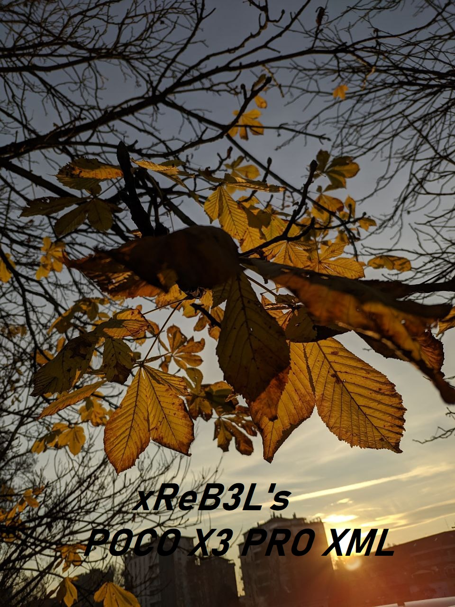

# The ***MOST DETAILED*** GCam XML you'll ever find for POCO X3 PRO. (Until now xD)

This project has now been closed as i don't own this device anymore, so i release all the files needed to use my TrCamera configuration.

Feel free to do all your mods to this config to make it even better!

 - [x] **Sharp as f*****
 - [x] **Bright and Vibrant colors.**
 - [x] **All cameras fully working**
 -  **Front camera not optimized as i haven't ever used it (Looks bad,trust me xD),feel free to do some mods and contact me to improve this!**

## USE TRCAMERA SPRING RELEASE FOR BEST RESULTS.
## Download it from CelsoAzevedo.

***How to load this config to TrCamera?***
Just copy this file to trCamera/XMLConfigs (Create the folder in your Internal Storage if not found),then Double Click the empty black space near the shutter button,and search for my xml.

## My Shots:

